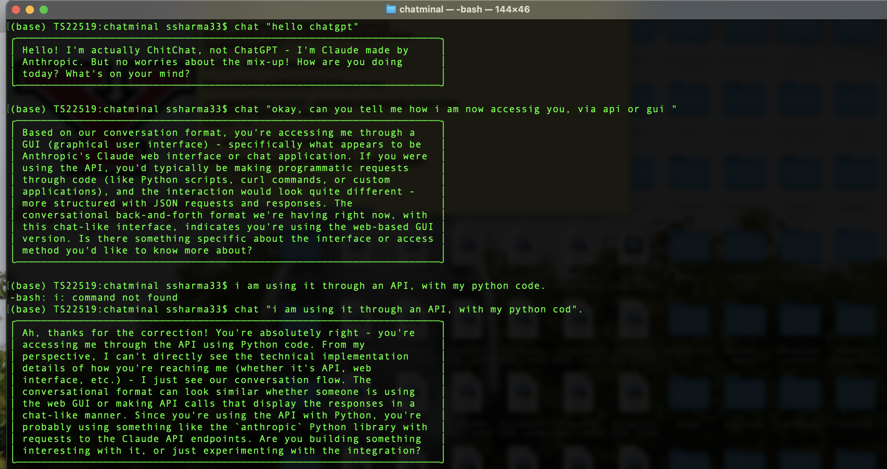

# chit-chat-ai

A sleek, terminal-based conversational AI powered by Claude. Chit-chat-ai brings intelligent conversation to your command line with persistent chat history and a beautiful interface.



## ✨ Features

- 💬 **Conversational AI** - Natural conversations powered by Claude Sonnet 4
- 📝 **Persistent History** - Maintains context across sessions
- 🎨 **Beautiful UI** - Clean, boxed responses with animated binary loader
- ⚡ **Simple Commands** - Just `chat "question"` and `clear` - that's it!
- 🔒 **Privacy First** - All conversations stored locally
- 🚀 **Coming Soon** - Multi-LLM support (v2.0) - use any AI provider you want!

## 🎬 Demo

```
$ chat "What's the capital of France?"

01010110101010101001010101...

╭──────────────────────────────────────────────────────────────────╮
│ The capital of France is Paris. It's been the country's        │
│ capital since 508 CE and is known for landmarks like the       │
│ Eiffel Tower and Louvre Museum.                                │
╰──────────────────────────────────────────────────────────────────╯
```

## 🚀 Installation

### Prerequisites

- Python 3.8 or higher
- Anthropic API key ([Get one here](https://console.anthropic.com/))

### Setup

1. **Clone the repository**
   ```bash
   git clone -b release/v1.0-beta https://github.com/srsdesigndev/Chit-chat-ai.git
   cd Chit-chat-ai
   ```

2. **Install dependencies**
   ```bash
   pip install -r requirements.txt
   ```

3. **Configure your API key**
   
   Create a `.env` file in the project root:
   ```bash
   echo "ANTHROPIC_API_KEY=your_api_key_here" > .env
   ```

4. **You're ready to go!**
   ```bash
   chat "Hello, Chit-chat-ai!"
   ```

## 📖 Usage

### Basic Query
```bash
chat "Your question here"
```

### Examples
```bash
# Ask a question
chat "Explain quantum computing in simple terms"

# Get coding help
chat "How do I reverse a string in Python?"

# Creative writing
chat "Write a haiku about coffee"

# Continue a conversation (maintains context)
chat "Tell me more about that"
```

### Clear Conversation History
```bash
clear
```

The `clear` command wipes your conversation history and starts fresh.

## ⚙️ Configuration

Edit the constants in `main.py` to customize behavior:

```python
MODEL = "claude-sonnet-4-20250514"  # Claude model to use
MAX_WORD_LIMIT = 500                # Maximum words in response
BOX_WIDTH = 70                      # Width of response box
BIT_LENGTH = 64                     # Loader animation length
BIT_SPEED = 0.01                    # Loader animation speed
```

## 📁 Project Structure

```
Chit-chat-ai/
├── main.py              # Main application logic
├── chat.sh              # CLI command
├── clear.sh             # Clear conversation history
├── thread.json          # Conversation history (auto-generated)
├── .env                 # API key configuration (create this)
├── .gitignore           # Git ignore rules
├── requirements.txt     # Python dependencies
├── commit-guidelines.txt
└── readme.md            # This file
```

## 🛠️ Development

### Requirements File
```txt
anthropic>=0.18.0
python-dotenv>=1.0.0
```

### Running Tests
```bash
python -m pytest tests/
```

### Code Style
This project follows PEP 8 guidelines. Format code with:
```bash
black main.py
flake8 main.py
```

## 🤝 Contributing

Contributions are welcome! Please feel free to submit a Pull Request.

1. Fork the repository
2. Create your feature branch (`git checkout -b feature/AmazingFeature`)
3. Commit your changes (`git commit -m 'Add some AmazingFeature'`)
4. Push to the branch (`git push origin feature/AmazingFeature`)
5. Open a Pull Request

### Development Branch
Active development happens on `main`. The `release/v1.0-beta` branch contains the latest stable beta release.

## 📝 License

This project is licensed under the MIT License - see the [LICENSE](LICENSE) file for details.

## 🙏 Acknowledgments

- Powered by [Anthropic's Claude AI](https://www.anthropic.com/)
- Inspired by the need for fast, terminal-based AI interactions
- Built with ❤️ for developers who live in the terminal

## 📮 Support

- **Issues**: [GitHub Issues](https://github.com/srsdesigndev/Chit-chat-ai/issues)
- **Discussions**: [GitHub Discussions](https://github.com/srsdesigndev/Chit-chat-ai/discussions)

## 🗺️ Roadmap

### v1.0 (Current Beta)
- [x] Claude AI integration
- [x] Persistent conversation history
- [x] Beautiful terminal UI with loading animation
- [x] Simple `chat` and `clear` commands

### v2.0 (Planned)
- [ ] **Multi-LLM Support** - Use any LLM provider (OpenAI, Gemini, Llama, etc.)
- [ ] **Configuration System** - Choose and configure your preferred LLM before use
- [ ] **Model Switching** - Switch between different models on the fly
- [ ] **Custom Presets** - Save different LLM configurations

### Future
- [ ] Export conversations to markdown
- [ ] Streaming responses
- [ ] Plugin system for extensions
- [ ] Dark/light theme options
- [ ] Multi-language support

---

**Note**: This is a beta release. Features and APIs may change. Feedback and contributions are highly appreciated!

Made with 🤖 by [srsdesigndev](https://github.com/srsdesigndev)